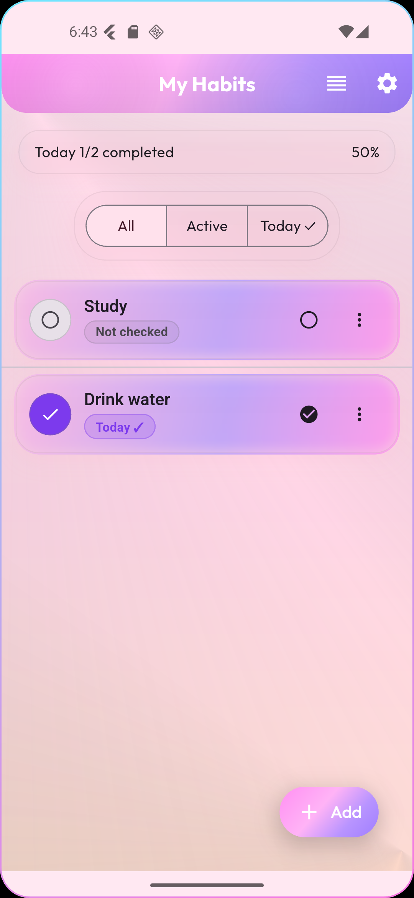
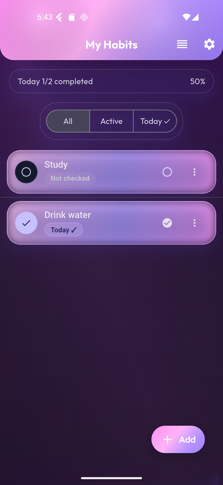
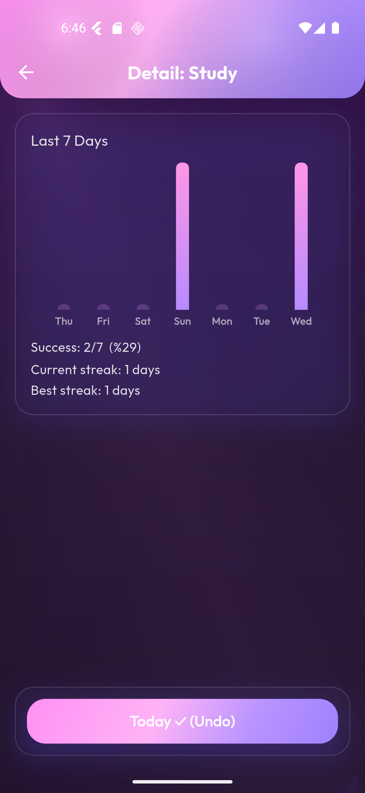
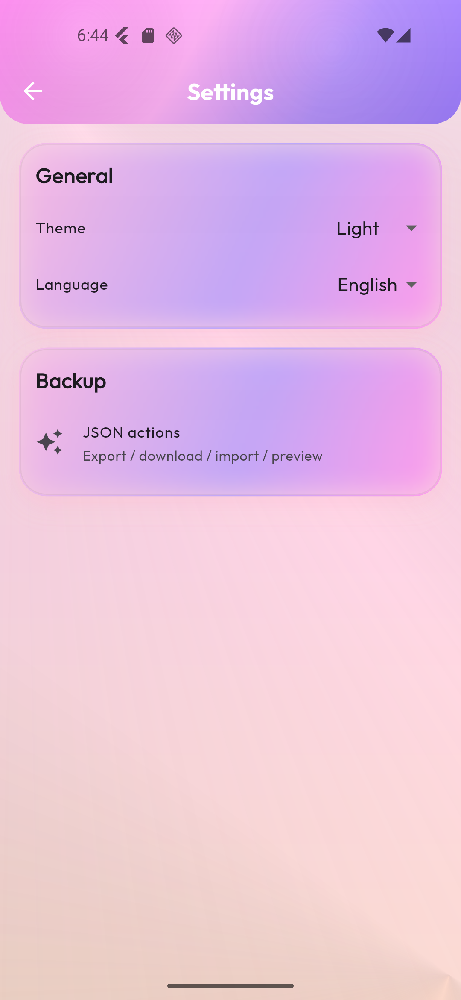

<h1 align="center">🌟 Habit Tracker (Flutter)</h1>

<p align="center">
  Basit, şık ve <b>2025 pastel-neon</b> tasarımlı bir <b>alışkanlık takip</b> uygulaması.<br/>
  📱 iOS/Android · 🌍 TR/EN yerelleştirme · 📊 7-gün grafiği & streak · 💾 JSON yedek / geri yükle · 🎨 Tema & dil · 🔔 Temel bildirim
</p>

<p align="center">
  <a href="#özellikler">Özellikler</a> •
  <a href="#ekran-görüntüleri">Ekran Görüntüleri</a> •
  <a href="#kurulum">Kurulum</a> •
  <a href="#çalıştırma">Çalıştırma</a> •
  <a href="#kullanım">Kullanım</a> •
  <a href="#yedekleme-şeması-json">JSON Şema</a> •
  <a href="#proje-yapısı">Yapı</a> •
  <a href="#yerelleştirme-l10n">l10n</a> •
  <a href="#build--dağıtım">Build</a> •
  <a href="#sss">SSS</a> •
  <a href="#lisans">Lisans</a>
</p>

---

## ✨ Özellikler
- ✅ **Alışkanlık Ekle/Düzenle/Sil** (boş/duplike korumalı)  
- ✅ **Günlük ✓**: Bugün için hızlı işaretleme, günlük ilerleme kartı (X/Y ve %)  
- ✅ **7-Gün Grafiği** (`fl_chart`) + **Streak**: `currentStreakNearest`, `bestStreak`  
- ✅ **Sürükle-Bırak Sıralama** (yalnızca *All* sekmesinde)  
- ✅ **Filtreler**: All / Active / Today ✓  
- ✅ **JSON Yedekleme & Geri Yükleme** (Paylaş, Kaydet, Önizle, Kopyala)  
- ✅ **Tema & Dil**: Light/Dark/System, Türkçe/İngilizce (kalıcı)  
- ✅ **Onboarding** (ilk açılış tanıtımı)  
- ✅ **Temel Bildirim** (debug modda 5 sn sonra örnek)  
- ✨ **Neon UI**: cam efektleri, çok duraklı degrade başlık, yumuşak glow  

---

## 🖼️ Ekran Görüntüleri
-   
-   
-   
-   

---

## ⚙️ Kurulum

### Gereksinimler
- **Flutter** 3.22+ (Dart 3)  
- Android Studio (SDK & Emulator) / Xcode (iOS için)  
- VSCode (önerilen) veya başka IDE  
- Git  

### Adımlar
```bash
# Flutter kurulumunu doğrula
flutter --version
flutter doctor

# Bağımlılıkları indir
flutter pub get
▶️ Çalıştırma
bash
Kodu kopyala
# Cihaz/Emülatör listesi
flutter devices

# Debug çalıştır (varsayılan cihaz)
flutter run

# Sadece Android
flutter run -d android
📌 İlk açılışta Android bildirim izni istenir. (Debug’da ~5 sn sonra test bildirimi gelir.)

🛠️ Kullanım
Onboarding: “Skip” veya sayfaları kaydır → ana liste

Ekle: sağ alt + → isim gir → Save

Düzenle / Sil / Detay: karttaki ⋯ menüsü

Bugün ✓: kartın sağındaki ikonla işaretle / geri al

Filtre: All / Active / Today ✓

Sıralama: AppBar’daki Reorder (sadece All sekmesinde)

Detay: Son 7 gün grafiği + Current/Best streak

Ayarlar: Tema (Light/Dark/System), Dil (TR/EN)

JSON Actions:

Share backup: Sistem paylaşım sayfasını açar

Download backup: Konum seç → kaydet (Open/Share kullanılabilir)

Import backup: Dosya seç → id veya name eşleşmesiyle merge

Preview / Copy: JSON metnini gösterir / kopyalar

💾 Yedekleme Şeması (JSON)
json
Kodu kopyala
{
  "type": "habit_backup",
  "version": 1,
  "exportedAt": "2025-10-02T20:00:00.000Z",
  "items": [
    {
      "id": "string",
      "name": "string",
      "lastCheckedYmd": "YYYY-MM-DD or ''",
      "history": { "YYYY-MM-DD": true }
    }
  ]
}
🔄 Merge Kuralları
id eşleşirse → history union (birinde true ise sonuç true)

name eşleşirse (case-insensitive) → yine union

Hiçbiri değilse → yeni kayıt eklenir

📂 Proje Yapısı
bash
Kodu kopyala
lib/
├─ core/
│  ├─ backup/ (backup_service.dart, import_service.dart)
│  ├─ settings/ (app_settings.dart, prefs_keys.dart)
│  └─ utils/ (date_utils.dart, id_utils.dart, validators.dart)
├─ features/
│  ├─ habits/ (data, domain, presentation/screens)
│  └─ onboarding/ (start_gate.dart, onboarding_screen.dart)
├─ l10n/ (app_en.arb, app_tr.arb, generated/)
└─ ui/
   ├─ theme/neon_theme.dart
   └─ widgets/ (neon_scaffold, neon_app_bar, neon_button, glass_card, vb.)
🌍 Yerelleştirme (l10n)
Desteklenen diller:

Türkçe (l10n/app_tr.arb)

İngilizce (l10n/app_en.arb)

🔑 Yeni Anahtar Ekleme
bash
Kodu kopyala
flutter gen-l10n
💡 Kullanım
dart
Kodu kopyala
AppLocalizations.of(context).<key>
📦 Build & Dağıtım
Android APK

bash
Kodu kopyala
flutter build apk --release
# Çıktı: build/app/outputs/apk/release/app-release.apk
GitHub Release

GitHub → Releases → Draft a new release

Tag (örn. v1.0.0) → notları yaz

Attach binaries ile app-release.apk’yi ekle

Publish release

iOS için Xcode + Apple Developer hesabı gerekir.

❓ SSS
“Open” ile dosya açılmıyor
Bazı cihazlar content:// URI’larını her uygulamada açmayabilir. Snackbar’daki Share ile farklı bir uygulamada açın.

Bildirim gelmiyor
Android’de izin verildiğinden emin olun (Ayarlar → Uygulama → Bildirimler). Debug’da 5 sn’lik test bildirimi vardır.

Gün değişince ✓ sıfırlanıyor mu?
Evet. isCheckedToday bugünün tarihine bakar; yeni günde yeniden işaretlemek gerekir.
